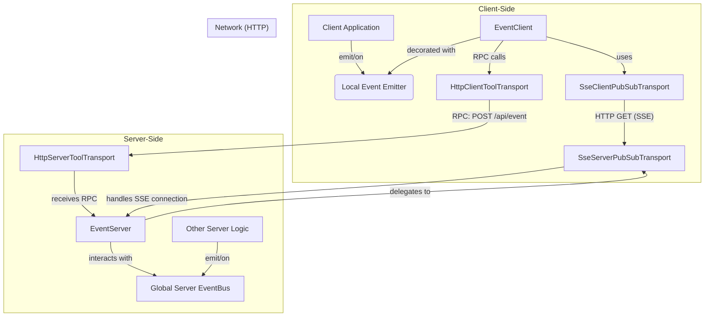

# Developer's Guide: Real-time Events with EventServer & EventClient

This guide provides a comprehensive overview of the `EventServer` and `EventClient` tools, a powerful system for real-time, bidirectional communication. It is built on a **pluggable PubSub transport layer**, making it independent of the underlying communication protocol. You can use Server-Sent Events (SSE), WebSockets, IPC, or any other protocol by providing a corresponding transport implementation.

**Prerequisite:** This document assumes you understand the base transport layer. If not, please review the [`transport.md`](./transport.md) first.

## Core Concept: The Unified Event Bus

The primary goal of this system is to create a seamless event bus that spans both the server and the client. It uses an abstract, pluggable PubSub transport for server-to-client messages and standard RPC calls for client-to-server messages.

The key feature is the ability to **"forward"** events. You can configure the server to automatically listen for events on its internal, global `eventBus` and relay them to clients. Likewise, you can configure the client to forward its local events to the server. This creates a powerful, decoupled architecture where different parts of your application can communicate without direct dependencies.

### Aspect-Oriented Programming (AoP) and Event Emitters

A crucial concept is that `EventClient` (and `ClientTools` in general) can be enhanced with event emitter capabilities. By using a library like `events-ex`, you can give your client-side tool instances standard `on`, `off`, and `emit` methods. This allows `EventClient` to act as a local event bus that is transparently synchronized with the server.

## Example: HTTP and Server-Sent Events (SSE)

### Architecture (SSE)

The following diagram illustrates how the components interact when using the provided SSE-based transport. Other transports (like WebSockets or IPC) would follow a similar pattern.



### Server-Side Setup (SSE)

On the server, you must set the desired PubSub transport on the `EventServer` class. When a client makes a request to the `eventServer`'s `list` endpoint, the `EventServer` delegates the connection handling to the transport.

```typescript
// In your server entry file (e.g., server.ts)
import {
  eventServer,
  HttpServerToolTransport, // Using a generic HTTP transport
  ResServerTools,
  EventServer, // Import EventServer class
  SseServerPubSubTransport // Import the SSE transport
} from '@isdk/ai-tool';

async function main() {
  // **Crucial Step: Set the PubSub transport for the server**
  EventServer.setPubSubTransport(new SseServerPubSubTransport());

  // Register the eventServer tool instance
  eventServer.register();

  const serverTransport = new HttpServerToolTransport();
  // Mount the base class; the transport finds all registered tools
  serverTransport.mount(ResServerTools, '/api');

  // ... start server
  await serverTransport.start({port: 3000})
}
```

### Client-Side Setup (SSE)

On the client, the setup is designed to be simple and robust. You set up your main RPC transport first, and then you set the PubSub transport. The `EventClient` is smart enough to automatically configure the PubSub transport with the `apiRoot` from the main transport.

```typescript
// In your client-side code
import {
  backendEventable,
  EventClient,
  eventClient,
  HttpClientToolTransport,
  ResClientTools,
  SseClientPubSubTransport // Import the SSE transport
} from '@isdk/ai-tool';

async function main() {
  const apiRoot = 'http://localhost:3000/api';
  const clientTransport = new HttpClientToolTransport();
  // Mount the main transport, which configures the static ClientTools.apiRoot
  await clientTransport.mount(ResClientTools, apiRoot);

  // **Crucial Step 1: Set the PubSub transport for the client**
  // It is **critical** that `setPubSubTransport` is called *after* the main
  // transport has been mounted, as this is what makes the `apiRoot` available
  // for automatic configuration.
  EventClient.setPubSubTransport(new SseClientPubSubTransport());

  // **Crucial Step 2: Make the client eventable**
  backendEventable(EventClient);
  eventClient.register();

  // Now you can use eventClient.on, .off, .emit to interact with the server
}
```

---

## General Usage (Transport-Agnostic)

Once the setup is complete, the API for using the event bus is the same regardless of the underlying transport.

### Forwarding and Publishing Events (Server-Side)

The server can push events to clients either by forwarding them from a central event bus or by publishing them directly.

```typescript
import { eventServer, EventServer } from '@isdk/ai-tool';
import { event } from '@isdk/ai-tool/funcs/event'; // The global eventBus

const eventBus = event.runSync();

// **Forwarding (Recommended)**
// Automatically relay events from the global eventBus to subscribed clients.
eventServer.forward(['user-updated', 'item-added']);

// Now, any other part of your server can simply emit events on the bus:
function updateUser(user: any) {
  eventBus.emit('user-updated', { userId: user.id, status: 'active' });
}

// **Direct Publishing**
// The `EventServer.publish` method allows sending an event directly to clients.
// Its signature is: `publish(event: string, data: any, target?: { clientId: string | string[] })`.

// 1. Broadcast to all clients subscribed to 'broadcast-message'.
// This is the default behavior when `target` is omitted.
function sendBroadcast() {
    EventServer.publish('broadcast-message', { message: 'Server is restarting soon!' });
}

// 2. Send a targeted event to a specific client.
// This requires knowing the `clientId` of the recipient.
function sendDirectMessage(clientId: string, message: string) {
    const target = { clientId };
    EventServer.publish('private-message', { text: message }, target);
}

// 3. Send an event to a group of specific clients.
function sendToGroup(clientIds: string[], message: string) {
    const target = { clientId: clientIds };
    EventServer.publish('group-message', { text: message }, target);
}

// **Receiving Client Events**
// Listen for events that were published or forwarded from a client.
eventBus.on('client-action', (data: any, event: any) => {
  console.log(`Received event "${event.type}" from a client:`, data);
});
```

### Subscribing, Listening, and Publishing (Client-Side)

```typescript
// **Subscribe and Listen**
await eventClient.subscribe(['user-updated', 'broadcast-message']);

eventClient.on('user-updated', (data: any) => {
  console.log('User updated on server!', data);
});

// **Publish an Event to the Server**
eventClient.publish({
    event: 'client-action',
    data: { action: 'button-click', value: 123 }
});

// **Forwarding Client Events (Recommended)**
eventClient.forwardEvent(['user-settings-changed']);

function onSettingsSave(newSettings: any) {
    eventClient.emit('user-settings-changed', newSettings);
}
```

This transport-agnostic architecture provides a clean, powerful, and decoupled way to build real-time, interactive applications. By separating the event logic from the communication protocol, you can choose the best transport for your needs while maintaining a consistent, unified event model.

---

## Implementing a Custom PubSub Transport

For developers who need to integrate a different messaging protocol (e.g., WebSockets, MQTT), you can create your own transport by implementing the server-side and client-side PubSub interfaces.

### Server-Side: `IPubSubServerTransport`

The server-side implementation is responsible for managing client connections and broadcasting events. You implement the `IPubSubServerTransport` interface from `@isdk/ai-tool/transports/pubsub/server`.

The core interface is defined as follows:

```typescript
export interface IPubSubServerTransport {
  readonly name: string;
  readonly protocol: string;

  /**
   * Subscribes a client to an event stream by taking over an incoming request.
   *
   * This method is designed to be generic. Transport-specific details, such as
   * HTTP request/response objects, are passed inside the `options` parameter.
   *
   * @param events Optional array of event names to initially subscribe the client to.
   * @param options A container for transport-specific parameters.
   * @returns A `PubSubClient` object representing the newly connected client.
   */
  subscribe: (
    events?: string[],
    options?: {
      req: any; // e.g., http.IncomingMessage
      res: any; // e.g., http.ServerResponse
      clientId?: string;
      [k: string]: any;
    }
  ) => PubSubClient; // Return a client object, minimally with a `clientId`.

  /**
   * Publishes an event from the server to clients.
   *
   * The `target` parameter allows for broadcasting (default) or
   * targeted delivery to specific client IDs.
   */
  publish: (
    event: string,
    data: any,
    target?: { clientId?: string | string[] }
  ) => void;

  // Lifecycle hooks to let the EventServer know about connections.
  onConnection: (cb: (session: PubSubServerSession) => void) => void;
  onDisconnect: (cb: (session: PubSubServerSession) => void) => void;

  /**
   * Optional: For bidirectional transports (e.g., WebSockets)
   * to handle messages received from the client.
   */
  onMessage?: (
    cb: (session: PubSubServerSession, event: string, data: any) => void
  ) => void;
}
```

By implementing this interface, your custom transport can be plugged directly into the `EventServer` using `EventServer.setPubSubTransport(new YourCustomTransport())`.

### Client-Side: `IPubSubClientTransport`

The client-side implementation is responsible for establishing a connection to the server and receiving events. This is defined by the `IPubSubClientTransport` interface from `@isdk/ai-tool/transports/pubsub/client`.

The core interface is defined as follows:

```typescript
export interface IPubSubClientTransport {
  /**
   * Establishes a connection to a server endpoint.
   * @param url The path of the endpoint, relative to the `apiRoot` configured on the transport. For advanced use or compatibility, this can also be a full, absolute URL.
   * @param params Optional parameters for the connection, such as initial event subscriptions.
   * @returns A `PubSubClientStream` instance representing the connection.
   */
  connect: (url: string, params?: Record<string, any>) => PubSubClientStream;

  /**
   * Optional. Disconnects a given stream.
   */
  disconnect?: (stream: PubSubClientStream) => void;

  /**
   * Optional. Configures the transport with a base URL.
   * If implemented, this allows the transport to resolve relative paths
   * passed to the `connect` method. This is called automatically by `EventClient.setPubSubTransport`.
   * @param apiRoot The base URL for the API.
   */
  setApiRoot?: (apiRoot: string) => void;
}
```

The `EventClient` automatically handles the `apiRoot` configuration, making the system easy to use. The `connect` method is the most critical part, as it decouples the `EventClient` from the specifics of how a connection is made.

By implementing both interfaces, you can enable the entire real-time event system over your chosen protocol.
