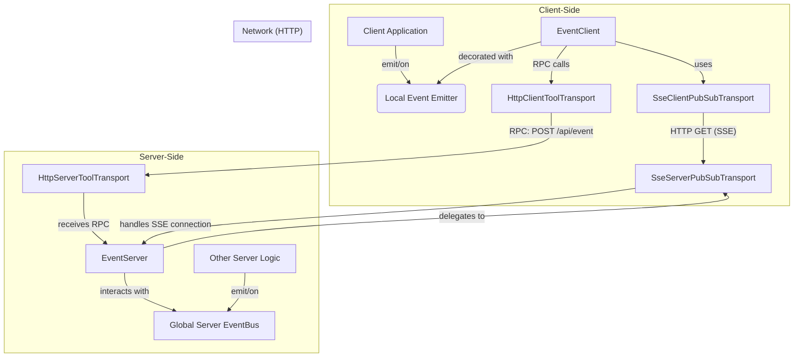

# Developer's Guide: Real-time Events with EventServer & EventClient

This guide provides a comprehensive overview of the `EventServer` and `EventClient` tools, a powerful system for real-time, bidirectional communication. It is built on a **pluggable PubSub transport layer**, making it independent of the underlying communication protocol. You can use Server-Sent Events (SSE), WebSockets, IPC, or any other protocol by providing a corresponding transport implementation.

**Prerequisite:** This document assumes you understand the base transport layer. If not, please review the [`transport.md`](./transport.md) first.

## Core Concept: The Unified Event Bus

The primary goal of this system is to create a seamless event bus that spans both the server and the client. It uses an abstract, pluggable PubSub transport for server-to-client messages and standard RPC calls for client-to-server messages.

The key feature is the ability to **"forward"** events. You can configure the server to automatically listen for events on its internal, global `eventBus` and relay them to clients. Likewise, you can configure the client to forward its local events to the server. This creates a powerful, decoupled architecture where different parts of your application can communicate without direct dependencies.

### Aspect-Oriented Programming (AoP) and Event Emitters

A crucial concept is that `EventClient` (and `ClientTools` in general) can be enhanced with event emitter capabilities. By using a library like `events-ex`, you can give your client-side tool instances standard `on`, `off`, and `emit` methods. This allows `EventClient` to act as a local event bus that is transparently synchronized with the server.

## Example: HTTP and Server-Sent Events (SSE)

### Architecture (SSE)

The following diagram illustrates how the components interact when using the provided SSE-based transport. Other transports (like WebSockets or IPC) would follow a similar pattern.



### Server-Side Setup (SSE)

On the server, you must set the desired PubSub transport on the `EventServer` class. When a client makes a request to the `eventServer`'s `list` endpoint, the `EventServer` delegates the connection handling to the transport.

```typescript
// In your server entry file (e.g., server.ts)
import {
  eventServer,
  HttpServerToolTransport, // Using a generic HTTP transport
  ResServerTools,
  EventServer, // Import EventServer class
  SseServerPubSubTransport // Import the SSE transport
} from '@isdk/ai-tool';

async function main() {
  // **Crucial Step: Set the PubSub transport for the server**
  EventServer.setPubSubTransport(new SseServerPubSubTransport());

  // Register the eventServer tool instance
  eventServer.register();

  const serverTransport = new HttpServerToolTransport();
  // Mount the base class; the transport finds all registered tools
  serverTransport.mount(ResServerTools, '/api');

  // ... start server
  await serverTransport.start({port: 3000})
}
```

### Client-Side Setup (SSE)

On the client, the setup is designed to be simple and robust. You set up your main RPC transport first, and then you set the PubSub transport. The `EventClient` is smart enough to automatically configure the PubSub transport with the `apiRoot` from the main transport.

```typescript
// In your client-side code
import {
  backendEventable,
  EventClient,
  eventClient,
  HttpClientToolTransport,
  ResClientTools,
  SseClientPubSubTransport // Import the SSE transport
} from '@isdk/ai-tool';

async function main() {
  const apiRoot = 'http://localhost:3000/api';
  const clientTransport = new HttpClientToolTransport();
  // Mount the main transport, which configures the static ClientTools.apiRoot
  await clientTransport.mount(ResClientTools, apiRoot);

  // **Crucial Step 1: Set the PubSub transport for the client**
  // It is **critical** that `setPubSubTransport` is called *after* the main
  // transport has been mounted, as this is what makes the `apiRoot` available
  // for automatic configuration.
  EventClient.setPubSubTransport(new SseClientPubSubTransport());

  // **Crucial Step 2: Make the client eventable**
  backendEventable(EventClient);
  eventClient.register();

  // Now you can use eventClient.on, .off, .emit to interact with the server
}
```

## Example: Electron IPC for Real-time Desktop Apps

For desktop applications built with Electron, the event system can operate over the built-in Inter-Process Communication (IPC) channels. This provides a highly efficient, real-time backend within your application shell without needing an HTTP server.

We will cover two scenarios: using IPC for Pub/Sub only, and a fully integrated approach where both RPC and Pub/Sub use IPC.

### Scenario 1: Standalone Pub/Sub over IPC

This approach is ideal if you only need a real-time eventing layer or if your main RPC communication uses a different transport (e.g., HTTP).

#### Main Process Setup (`main.ts`)

You only need to set up the `ElectronServerPubSubTransport` and tell it to start listening.

```typescript
// In your main Electron process (e.g., main.ts)
import { EventServer, ElectronServerPubSubTransport } from '@isdk/ai-tool';

// 1. Define a unique namespace for your pub/sub channels.
const pubSubNamespace = 'my-app-events';

// 2. Create an instance of the server transport.
const serverTransport = new ElectronServerPubSubTransport(pubSubNamespace);

// 3. Set the transport for the global EventServer.
EventServer.setPubSubTransport(serverTransport);

// 4. **Crucial Step: Activate the transport's IPC listeners.**
serverTransport.listen();

// Now the EventServer is ready. You can publish events from anywhere
// in the main process, and they will be sent to subscribed renderers.
console.log('[Main] Pub/Sub transport listening...');
setInterval(() => {
  EventServer.publish('server-tick', { timestamp: Date.now() });
}, 5000);
```

#### Renderer Process Setup (`renderer.ts`)

The client setup is also straightforward. You must configure the `EventClient` with the same namespace.

```typescript
// In your client-side code (e.g., renderer.ts)
import { EventClient, eventClient, ElectronClientPubSubTransport, backendEventable } from '@isdk/ai-tool';

// 1. Use the same namespace as the server.
const pubSubNamespace = 'my-app-events';

// 2. Set the PubSub transport for the client.
EventClient.setPubSubTransport(new ElectronClientPubSubTransport());

// 3. **Crucial Step: Configure the EventClient with the namespace.**
// This is used as the 'apiRoot' to determine which IPC channels to use.
EventClient.apiRoot = pubSubNamespace;

// 4. Make the client eventable and register it.
backendEventable(EventClient);
eventClient.register();

// 5. Subscribe to events. This automatically triggers the connection to the main process.
await eventClient.subscribe('server-tick');

eventClient.on('server-tick', (data) => {
  console.log('Received tick from main process:', data);
  document.body.innerHTML = `Tick received at: ${data.timestamp}`;
});
```
> **Note on Security**: This simple example assumes `contextIsolation` is disabled. For modern, secure Electron apps, please see the integrated example below which includes a `preload.js` script.

### Scenario 2: Integrated RPC and Pub/Sub over IPC

This is the recommended, fully-native approach for Electron apps. It provides both request-response (RPC) and real-time events over the same efficient IPC foundation. This requires a `preload.js` script to securely bridge the main and renderer processes.

#### Part 1: Preload Script (`preload.ts`)

This script acts as a secure bridge, exposing only the necessary IPC functions to the renderer process. Your `BrowserWindow` webPreferences should point to this file.

```typescript
// preload.ts
import { contextBridge, ipcRenderer, IpcRendererEvent } from 'electron';

// Define the API that will be exposed to the renderer process via `window.electronApi`
const electronApi = {
  // For RPC (invoke/handle)
  invoke: (channel: string, ...args: any[]) => ipcRenderer.invoke(channel, ...args),
  
  // For Pub/Sub (send/on)
  send: (channel: string, ...args: any[]) => ipcRenderer.send(channel, ...args),
  on: (channel: string, listener: (event: IpcRendererEvent, ...args: any[]) => void) => {
    ipcRenderer.on(channel, listener);
  },
  off: (channel: string, listener: (...args: any[]) => void) => {
    ipcRenderer.removeListener(channel, listener);
  },
};

// Securely expose the API to the renderer's window object
contextBridge.exposeInMainWorld('electronApi', electronApi);

// Optional: Define a type for your exposed API for better TypeScript support
export type ElectronApi = typeof electronApi;
```

#### Part 2: Main Process Setup (`main.ts`)

Here, we set up both the `IpcServerToolTransport` for RPC and the `ElectronServerPubSubTransport` for Pub/Sub.

```typescript
// main.ts
import { IpcServerToolTransport } from '@isdk/ai-tool';
import { ElectronServerPubSubTransport } from '@isdk/ai-tool';
import { EventServer, ResServerTools, eventServer } from '@isdk/ai-tool';

// Use a single, consistent namespace for all IPC channels
const channelNamespace = 'my-app';

// --- 1. Setup IPC for standard RPC ---
const rpcTransport = new IpcServerToolTransport();
// This sets up handlers for 'my-app:discover' and 'my-app:rpc'.
rpcTransport.mount(ResServerTools, channelNamespace); 
rpcTransport.start();
console.log(`[Main] RPC transport started on namespace: ${channelNamespace}`);

// --- 2. Setup IPC for Pub/Sub ---
const pubsubTransport = new ElectronServerPubSubTransport(channelNamespace);
EventServer.setPubSubTransport(pubsubTransport);
pubsubTransport.listen(); // Activate the pub/sub listeners
console.log(`[Main] Pub/Sub transport listening on namespace: ${channelNamespace}`);

// --- 3. Register Tools ---
// Register the eventServer so its methods (sub, unsub) can be called via RPC
eventServer.register();
```

#### Part 3: Renderer Process Setup (`renderer.ts`)

The renderer will use the `electronApi` exposed by the preload script. To make this work seamlessly, you can create simple wrapper classes for your transports that use the bridged API instead of the raw `ipcRenderer`.

```typescript
// renderer.ts
import { IpcClientToolTransport, ElectronClientPubSubTransport, EventClient, ResClientTools, eventClient, backendEventable } from '@isdk/ai-tool';
import type { ElectronApi } from './preload';

// Make the bridged API available on the window object for TypeScript
declare global {
  interface Window { electronApi: ElectronApi; }
}

// --- Custom Transports Using the Secure Bridge ---

// 1. Create a custom RPC transport that uses the bridged `invoke` method.
class SecureIpcRpcTransport extends IpcClientToolTransport {
  async _fetch(name: string, args?: any, act?: any, subName?: any) {
    const payload = { toolId: name, params: args || {}, act, id: subName };
    return window.electronApi.invoke(this.channels.rpc, payload);
  }
  async loadApis() {
    return window.electronApi.invoke(this.channels.discover);
  }
}

// 2. Create a custom Pub/Sub transport that uses the bridged API.
// This pattern requires that the base transport class allows for dependency injection.
class SecureIpcPubSubTransport extends ElectronClientPubSubTransport {
  constructor() {
    // Pass the bridged API to the constructor instead of letting it use the global ipcRenderer
    super(window.electronApi as any);
  }
}

// --- Application Setup ---
async function main() {
  const channelNamespace = 'my-app';

  // Use the secure RPC transport
  const rpcTransport = new SecureIpcRpcTransport();
  await rpcTransport.mount(ResClientTools, channelNamespace);

  // Use the secure Pub/Sub transport
  const pubsubTransport = new SecureIpcPubSubTransport();
  EventClient.setPubSubTransport(pubsubTransport);
  EventClient.apiRoot = channelNamespace;

  backendEventable(EventClient);
  eventClient.register();

  // Now you can use RPC and Pub/Sub together seamlessly and securely!
  await eventClient.subscribe('server-time');
  eventClient.on('server-time', (data) => {
    console.log('Received time from main:', data);
  });
}

main();
```

---

## General Usage (Transport-Agnostic)

Once the setup is complete, the API for using the event bus is the same regardless of the underlying transport.

### Forwarding and Publishing Events (Server-Side)

There are two ways to send events from the server to clients: through the global `eventBus` (standard approach) or by publishing directly to the transport (advanced approach).

#### Standard Approach: Forwarding from the Event Bus

The recommended and most common way to send events is to emit them on the global `eventBus`. You can configure the `eventServer` to automatically listen for specific events on this bus and forward them to subscribed clients. This creates a clean, decoupled architecture.

```typescript
import { eventServer } from '@isdk/ai-tool';
import { event } from '@isdk/ai-tool/funcs/event'; // The global eventBus

const eventBus = event.runSync();

// 1. Configure the server to forward events.
eventServer.forward(['user-updated', 'item-added']);

// 2. Now, any other part of your server can simply emit events on the bus.
function updateUser(user: any) {
  eventBus.emit('user-updated', { userId: user.id, status: 'active' });
}
```

#### Advanced Approach: Direct Publishing to the Transport

For special cases where you need to bypass the global `eventBus` and send an event directly to the transport layer, you can use the static `EventServer.publish()` method.

This is an advanced feature. For it to work correctly, the client must have explicitly registered its interest in the event at the transport level, typically by using `eventClient.init(['event-name'])`.

```typescript
import { EventServer } from '@isdk/ai-tool';

// The signature is: `publish(event: string, data: any, target?: { clientId: string | string[] })`.

// 1. Broadcast to all clients that used init() to subscribe to 'broadcast-message'.
function sendBroadcast() {
    EventServer.publish('broadcast-message', { message: 'Server is restarting soon!' });
}

// 2. Send a targeted event to a specific client.
function sendDirectMessage(clientId: string, message: string) {
    const target = { clientId };
    EventServer.publish('private-message', { text: message }, target);
}
```

### Receiving and Distinguishing Events on the Server

A key design feature of the event system is the clear, safe separation between events originating from the server's internal logic and events published by clients. This is achieved by automatically prefixing all client-originated events with `client:`.

This mechanism prevents clients from accidentally or maliciously triggering sensitive internal events, and allows server-side plugins to focus on business logic without needing to manually check the origin of every event.

#### Example 1: Listening for an Internal Server Event

This is the standard way to listen for events that are part of the server's own workflow. This listener will **never** be triggered by a client publishing an event with the same name.

```typescript
import { event } from '@isdk/ai-tool/funcs/event';
const eventBus = event.runSync();

// Listens for an event triggered only by server-side logic.
// e.g., eventBus.emit('data-updated', { id: 123 });
eventBus.on('data-updated', (data) => {
  console.log('Internal data has been updated. Refreshing cache...');
  // ...purely internal business logic
});
```

#### Example 2: Listening for a Client-Originated Event

To react to an event published by a client, you must explicitly listen for the event name with the `client:` prefix. The listener will also receive a metadata object containing the trusted, server-verified `clientId`.

```typescript
import { event } from '@isdk/ai-tool/funcs/event';
const eventBus = event.runSync();

// A client publishes an event like:
// eventClient.publish({ event: 'user-action', data: { ... } });

// The server-side listener must use the 'client:' prefix.
eventBus.on('client:user-action', (data, meta) => {
  // The 'meta' object contains the trusted clientId from the transport layer.
  const { clientId } = meta;
  console.log(`User ${clientId} performed an action with data:`, data);
  // ...logic to handle the client interaction
});
```

### Subscribing, Listening, and Publishing (Client-Side)

```typescript
// **Subscribe and Listen**
await eventClient.subscribe(['user-updated', 'broadcast-message']);

eventClient.on('user-updated', (data: any) => {
  console.log('User updated on server!', data);
});

// **Publish an Event to the Server**
// This sends the event to the server. On the server's internal event bus,
// it will be prefixed and emitted as 'client:client-action'.
// Other clients will receive it as the original 'client-action'.
eventClient.publish({
    event: 'client-action',
    data: { action: 'button-click', value: 123 }
});

// **Forwarding Client Events (Recommended)**
eventClient.forwardEvent(['user-settings-changed']);

function onSettingsSave(newSettings: any) {
    // This emits the event on the local event bus. Because it was forwarded,
    // it will also be published to the server.
    eventClient.emit('user-settings-changed', newSettings);
}
```

This transport-agnostic architecture provides a clean, powerful, and decoupled way to build real-time, interactive applications. By separating the event logic from the communication protocol, you can choose the best transport for your needs while maintaining a consistent, unified event model.

---

## Implementing a Custom PubSub Transport

For developers who need to integrate a different messaging protocol (e.g., WebSockets, MQTT), you can create your own transport by implementing the server-side and client-side PubSub interfaces.

### Server-Side: `IPubSubServerTransport`

The server-side implementation is responsible for managing client connections and broadcasting events. You implement the `IPubSubServerTransport` interface from `@isdk/ai-tool/transports/pubsub/server`.

The core interface is defined as follows:

```typescript
export interface IPubSubServerTransport {
  readonly name: string;
  readonly protocol: string;

  /**
   * Subscribes a client to an event stream by taking over an incoming request.
   *
   * This method is designed to be generic. Transport-specific details, such as
   * HTTP request/response objects, are passed inside the `options` parameter.
   *
   * @param events Optional array of event names to initially subscribe the client to.
   * @param options A container for transport-specific parameters.
   * @returns A `PubSubClient` object representing the newly connected client.
   */
  subscribe: (
    events?: string[],
    options?: {
      req: any; // e.g., http.IncomingMessage
      res: any; // e.g., http.ServerResponse
      clientId?: string;
      [k: string]: any;
    }
  ) => PubSubClient; // Return a client object, minimally with a `clientId`.

  /**
   * Publishes an event from the server to clients.
   *
   * The `target` parameter allows for broadcasting (default) or
   * targeted delivery to specific client IDs.
   */
  publish: (
    event: string,
    data: any,
    target?: { clientId?: string | string[] }
  ) => void;

  // Lifecycle hooks to let the EventServer know about connections.
  onConnection: (cb: (session: PubSubServerSession) => void) => void;
  onDisconnect: (cb: (session: PubSubServerSession) => void) => void;

  /**
   * Optional: For bidirectional transports (e.g., WebSockets)
   * to handle messages received from the client.
   */
  onMessage?: (
    cb: (session: PubSubServerSession, event: string, data: any) => void
  ) => void;
}
```

By implementing this interface, your custom transport can be plugged directly into the `EventServer` using `EventServer.setPubSubTransport(new YourCustomTransport())`.

### Client-Side: `IPubSubClientTransport`

The client-side implementation is responsible for establishing a connection to the server and receiving events. This is defined by the `IPubSubClientTransport` interface from `@isdk/ai-tool/transports/pubsub/client`.

The core interface is defined as follows:

```typescript
export interface IPubSubClientTransport {
  /**
   * Establishes a connection to a server endpoint.
   * @param url The path of the endpoint, relative to the `apiRoot` configured on the transport. For advanced use or compatibility, this can also be a full, absolute URL.
   * @param params Optional parameters for the connection, such as initial event subscriptions.
   * @returns A `PubSubClientStream` instance representing the connection.
   */
  connect: (url: string, params?: Record<string, any>) => PubSubClientStream;

  /**
   * Optional. Disconnects a given stream.
   */
  disconnect?: (stream: PubSubClientStream) => void;

  /**
   * Optional. Configures the transport with a base URL.
   * If implemented, this allows the transport to resolve relative paths
   * passed to the `connect` method. This is called automatically by `EventClient.setPubSubTransport`.
   * @param apiRoot The base URL for the API.
   */
  setApiRoot?: (apiRoot: string) => void;
}
```

The `EventClient` automatically handles the `apiRoot` configuration, making the system easy to use. The `connect` method is the most critical part, as it decouples the `EventClient` from the specifics of how a connection is made.

By implementing both interfaces, you can enable the entire real-time event system over your chosen protocol.
