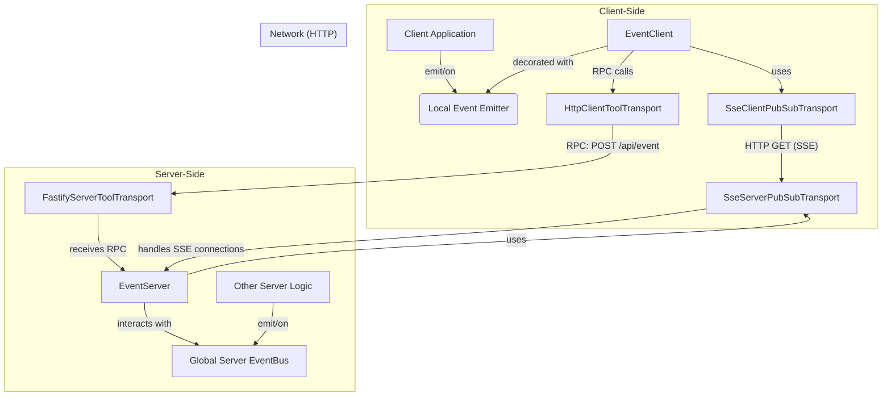

# Developer's Guide: Real-time Events with EventServer & EventClient

This guide provides a comprehensive overview of the `EventServer` and `EventClient` tools, a powerful system for real-time, bidirectional communication. It is built on a **pluggable PubSub transport layer**, making it independent of the underlying communication protocol. You can use Server-Sent Events (SSE), WebSockets, IPC, or any other protocol by providing a corresponding transport implementation.

**Prerequisite:** This document assumes you understand the base transport layer. If not, please review the [`transport_readme.md`](./transport_readme.md) first.

## Core Concept: The Unified Event Bus

The primary goal of this system is to create a seamless event bus that spans both the server and the client. It uses an abstract, pluggable PubSub transport for server-to-client messages and standard RPC calls for client-to-server messages.

The key feature is the ability to **"forward"** events. You can configure the server to automatically listen for events on its internal, global `eventBus` and relay them to clients. Likewise, you can configure the client to forward its local events to the server. This creates a powerful, decoupled architecture where different parts of your application can communicate without direct dependencies.

### Aspect-Oriented Programming (AoP) and Event Emitters

A crucial concept is that `EventClient` (and `ClientTools` in general) can be enhanced with event emitter capabilities. By using a library like `events-ex`, you can give your client-side tool instances standard `on`, `off`, and `emit` methods. This allows `EventClient` to act as a local event bus that is transparently synchronized with the server.

## Example 1: HTTP and Server-Sent Events (SSE)

### Architecture (SSE)

The following diagram illustrates how the components interact when using the provided SSE-based transport. Other transports (like WebSockets or IPC) would follow a similar pattern.



### Server-Side Setup (SSE)

In your server setup, you must first tell `EventServer` which transport to use, then register the `eventServer` instance.

```typescript
// In your server entry file (e.g., server.ts)
import {
  eventServer,
  FastifyServerToolTransport,
  ResServerTools,
  EventServer, // Import EventServer class
  SseServerPubSubTransport // Import the SSE transport
} from '@isdk/ai-tool';

async function main() {
  // **Crucial Step: Set the PubSub transport for the server**
  EventServer.setPubSubTransport(new SseServerPubSubTransport());

  // Register the eventServer tool instance
  eventServer.register();

  const serverTransport = new FastifyServerToolTransport();
  // Mount the base class; the transport finds all registered tools
  serverTransport.mount(ResServerTools, '/api');

  // ... start server
  await serverTransport.start({port: 3000})
}
```

### Client-Side Setup (SSE)

On the client, you must set the appropriate PubSub transport (matching the server's), enhance the `EventClient` with `EventEmitter` capabilities, and register the instance.

```typescript
// In your client-side code
import {
  backendEventable,
  EventClient,
  eventClient,
  HttpClientToolTransport,
  ResClientTools,
  SseClientPubSubTransport // Import the SSE transport
} from '@isdk/ai-tool';

async function main() {
  const apiRoot = 'http://localhost:3003/api';
  const clientTransport = new HttpClientToolTransport(apiRoot);
  await clientTransport.mount(ResClientTools);

  // **Crucial Step 1: Set the PubSub transport for the client**
  EventClient.setPubSubTransport(new SseClientPubSubTransport());

  // **Crucial Step 2: Make the client eventable**
  backendEventable(EventClient);
  eventClient.register();

  // Now you can use eventClient.on, .off, .emit
}
```

---

## Example 2: Electron IPC Transport

This transport uses Electron's Inter-Process Communication (IPC) to create an event bus between the main process (server) and renderer processes (clients).

### Server-Side Setup (Electron Main Process)

In your Electron main process, you instantiate an `ElectronServerPubSubTransport` with a unique namespace. This namespace acts like an `apiRoot` and ensures that different event buses don't conflict.

```typescript
// In your Electron main process (e.g., main.ts)
import {
  EventServer,
  eventServer,
  ElectronServerPubSubTransport,
} from '@isdk/ai-tool';

// 1. Define a unique namespace for this event bus
const electronApiRoot = '/electron/events';

// 2. Create a transport instance for this specific namespace
const electronTransport = new ElectronServerPubSubTransport(electronApiRoot);

// 3. Set the transport on the EventServer
// Note: This is a static property. For multiple, different event servers
// (e.g., one for SSE, one for Electron), you would create subclasses of EventServer
// to hold each static transport instance separately.
EventServer.setPubSubTransport(electronTransport);

// 4. Register the eventServer tool instance. It will now use the Electron transport.
eventServer.register();

// Now you can use the global eventBus to emit events, and the EventServer
// will forward them to any connected renderer process.
```

### Client-Side Setup (Electron Renderer Process)

In the renderer process, you must use the same namespace (`apiRoot`) to connect to the correct event bus in the main process.

**Important:** The `EventClient` still relies on an RPC mechanism for actions like `subscribe` and `unsubscribe`. You must have a corresponding RPC transport set up between the renderer and main process for the full functionality to work. The example below focuses only on setting up the PubSub portion.

```typescript
// In your Electron renderer process (e.g., preload.ts or renderer.ts)
import {
  EventClient,
  eventClient,
  ElectronClientPubSubTransport,
  backendEventable,
} from '@isdk/ai-tool';

// 1. The apiRoot MUST match the namespace used in the main process
const electronApiRoot = '/electron/events';

// 2. Set the PubSub transport on the EventClient class
EventClient.setPubSubTransport(new ElectronClientPubSubTransport());

// 3. Make the EventClient class event-aware
backendEventable(EventClient);

// 4. Configure the eventClient INSTANCE
// This tells the client which event bus to connect to.
eventClient.setApiRoot(electronApiRoot);
eventClient.register();

// 5. Now you can use the event client
async function setupEvents() {
  await eventClient.subscribe('some-event-from-main');

  eventClient.on('some-event-from-main', (data) => {
    console.log('Received event from main process:', data);
  });

  // Forward a local event to the main process
  eventClient.forwardEvent('event-from-renderer');
  eventClient.emit('event-from-renderer', { my: 'data' });
}

setupEvents();
```

---

## General Usage (Transport-Agnostic)

Once the setup is complete, the API for using the event bus is the same regardless of the underlying transport.

### Forwarding and Publishing Events (Server-Side)

The server can push events to clients either by forwarding them from a central event bus or by publishing them directly. With the latest updates, the `publish` method now supports targeted delivery to specific clients, in addition to broadcasting.

**Note:** The availability of targeted publishing depends on the underlying transport implementation. While the `EventServer` API supports it, some transports (like the current SSE transport) may only be capable of broadcasting.

```typescript
import { eventServer, EventServer } from '@isdk/ai-tool';
import { event } from '@isdk/ai-tool/funcs/event'; // The global eventBus

const eventBus = event.runSync();

// **Forwarding (Recommended)**
// Automatically relay events from the global eventBus to subscribed clients.
eventServer.forward(['user-updated', 'item-added']);

// Now, any other part of your server can simply emit events on the bus:
function updateUser(user: any) {
  eventBus.emit('user-updated', { userId: user.id, status: 'active' });
}

// **Direct Publishing**
// The `EventServer.publish` method allows sending an event directly to clients.
// Its signature is: `publish(event: string, data: any, target?: { clientId: string | string[] })`.

// 1. Broadcast to all clients subscribed to 'broadcast-message'.
// This is the default behavior when `target` is omitted.
function sendBroadcast() {
    EventServer.publish('broadcast-message', { message: 'Server is restarting soon!' });
}

// 2. Send a targeted event to a specific client.
// This requires knowing the `clientId` of the recipient.
function sendDirectMessage(clientId: string, message: string) {
    const target = { clientId };
    EventServer.publish('private-message', { text: message }, target);
}

// 3. Send an event to a group of specific clients.
function sendToGroup(clientIds: string[], message: string) {
    const target = { clientId: clientIds };
    EventServer.publish('group-message', { text: message }, target);
}

// **Receiving Client Events**
// Listen for events that were published or forwarded from a client.
eventBus.on('client-action', (data: any, event: any) => {
  console.log(`Received event "$\{event.type\}" from a client:`, data);
});
```

### Subscribing, Listening, and Publishing (Client-Side)

```typescript
// **Subscribe and Listen**
await eventClient.subscribe(['user-updated', 'broadcast-message']);

eventClient.on('user-updated', (data: any) => {
  console.log('User updated on server!', data);
});

// **Publish an Event to the Server**
eventClient.publish({
    event: 'client-action',
    data: { action: 'button-click', value: 123 }
});

// **Forwarding Client Events (Recommended)**
eventClient.forwardEvent(['user-settings-changed']);

function onSettingsSave(newSettings: any) {
    eventClient.emit('user-settings-changed', newSettings);
}
```

This transport-agnostic architecture provides a clean, powerful, and decoupled way to build real-time, interactive applications. By separating the event logic from the communication protocol, you can choose the best transport for your needs while maintaining a consistent, unified event model.

---

## Implementing a Custom PubSub Transport

For developers who need to integrate a different messaging protocol (e.g., WebSockets, MQTT), you can create your own transport by implementing the server-side and client-side PubSub interfaces.

### Server-Side: `IPubSubServerTransport`

The server-side implementation is responsible for managing client connections and broadcasting events. You implement the `IPubSubServerTransport` interface from `@isdk/ai-tool/transports/pubsub/server`.

The core interface is defined as follows:

```typescript
export interface IPubSubServerTransport {
  readonly name: string;
  readonly protocol: string;

  // Optional: For transports that need to hook into an HTTP server
  mount?: (path: string, options?: Record<string, any>) => void;

  // Establish a connection with a client and subscribe them to events.
  // The `options` object is a generic container for transport-specific
  // parameters, like HTTP request/response objects for SSE.
  subscribe: (
    events?: string[],
    options?: {
      req?: any;
      res?: any;
      clientId?: string;
      [k: string]: any;
    }
  ) => PubSubClient; // Return a client object, minimally with a `clientId`.

  // Publish an event from the server to clients.
  // The `target` parameter allows for broadcasting (default) or
  // targeted delivery to specific client IDs.
  publish: (
    event: string,
    data: any,
    target?: { clientId?: string | string[] }
  ) => void;

  // Lifecycle hooks to let the EventServer know about connections.
  onConnection: (cb: (session: PubSubServerSession) => void) => void;
  onDisconnect: (cb: (session: PubSubServerSession) => void) => void;

  // Optional: For bidirectional transports (e.g., WebSockets)
  // to handle messages received from the client.
  onMessage?: (
    cb: (session: PubSubServerSession, event: string, data: any) => void
  ) => void;
}
```

By implementing this interface, your custom transport can be plugged directly into the `EventServer` using `EventServer.setPubSubTransport(new YourCustomTransport())`.

### Client-Side: `IPubSubClientTransport`

The client-side implementation is responsible for establishing a connection to the server and receiving events. This is defined by the `IPubSubClientTransport` interface from `@isdk/ai-tool/transports/pubsub/client`.

The core interface is defined as follows:

```typescript
export interface IPubSubClientTransport {
  /**
   * Establishes a connection to a server endpoint.
   * @param url The base URL of the server's PubSub endpoint.
   * @param params Optional parameters for the connection. This is where
   *   data like initial event subscriptions should be passed. The transport
   *   is responsible for encoding these params into the request (e.g., as a query string).
   * @returns A `PubSubClientStream` instance representing the connection.
   */
  connect: (url: string, params?: Record<string, any>) => PubSubClientStream;

  /**
   * Optional. Disconnects a given stream.
   */
  disconnect?: (stream: PubSubClientStream) => void;
}
```

The `connect` method is the most critical part. It decouples the `EventClient` from the specifics of how connection parameters (like initial subscriptions) are sent to the server. The `EventClient` simply passes them in the `params` object, and the transport implementation handles the rest.

By implementing both interfaces, you can enable the entire real-time event system over your chosen protocol.
